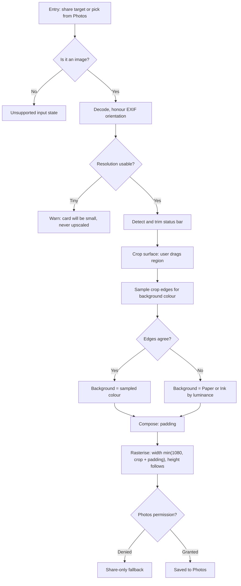

# Social Card Renderer App

*As of September 16, 2026. Restructured around screenshot input; the link-fetch
design and its measured endpoint behaviour are preserved in the appendix.*

## Problem

Manually screenshotting tweets, Threads posts, and Instagram posts produces crops
that sit too close to the content, dragging in likes, icons, and reply counts, with
no breathing room around the actual text or media. Existing "quote card" apps solve
the crop problem but slap on their own branding or reformat things oddly.

## Concept

The user screenshots the post themselves, shares the image into the app, and drags a
crop to the part they want. The app re-renders that crop with generous, adjustable
padding on a background matched to the screenshot. Output saves to Photos or
shares straight to WhatsApp. (It also offered a mask tool, Cover, for chrome the
crop could not exclude, until the owner cut it on 2026-09-22; see below.)

No fetching, no API, no network. The app is a crop-and-compose tool, which is why it
works on anything the user can see: public posts, private accounts, locked posts,
DMs, Slack, Discord, LinkedIn.

### Why this rather than fetching from a link

An earlier design took a post link and rebuilt the card from fetched data. That
works, and the appendix records exactly how far it works, but screenshot input wins
on nearly every axis that matters here:

| | Screenshot input | Link input (appendix) |
| --- | --- | --- |
| Platform coverage | anything on screen | X, Threads, Instagram |
| Private / login-walled posts | works | impossible |
| Quote posts, reply parents | **free** — already in the pixels | two fetch chains, one fragile |
| Instagram resolution | device resolution, 1080–1440 | capped at a 640×640 crop |
| Fragility | no network at all | OG scraping, `t.co` meta-refresh parsing, DOM-walking for reply parents, rate limits, signed URLs expiring in 5 days |
| Code | a crop UI; everything below is shared | the entire fetch layer |

What it gives up: fixed pixels. A light-mode screenshot stays light, text cannot be
re-wrapped, and a saved card cannot be re-rendered later in a different theme. Those
are real, and they are what the link path would buy back in v2.

### The honest weakness, and the fix that was cut

**Cover was cut by the owner on 2026-09-22.** The weakness below is real and is
now simply accepted: on Instagram a card keeps the like count or loses the
caption. The fix is kept as a record of what was measured, and BUILD-PLAN.md's
Phase 3 holds the design to return to if redaction is ever wanted.

A crop cannot remove chrome that sits *between* two things the user wants. On X the
action bar sits below the post text, so cropping it away works. On Instagram the
on-screen order runs image → action row → like count → caption, so a crop keeping
both the image and the caption keeps the like count with it — which is precisely
what the problem statement is about.

Hence the **mask tool** as it was designed: after cropping, the user drags a box
over leftover chrome and it is filled with the colour sampled from immediately
around the box. Social UIs are flat single-colour backgrounds, so a sampled fill is
seamless without real inpainting. It was called the thing that decides whether the
app delivers the stated problem or only most of it, and it was prototyped first.

**Measured, 2026-09-16** (`spike/results/phase0-q1-q3.md`). On a real dark-mode X
capture and a real dark-mode Instagram capture, every row the Cover tool would
have targeted has a background spread below 1/255 — the engagement rows come in at 0.04
to 0.59. The premise holds.

With one condition that changed the implementation: **the fill is the ring's modal
colour, not its mean.** The sampling ring around a like-count row catches
ascenders and descenders from the rows either side, and a mean is dragged by them.
On one measured row a mean fill came out `#7F7F7F` — mid grey — where the actual
background was `#000000`. That is not a subtle error; it is a guaranteed seam on
every dark post. The mean also overstated roughness by up to 17x, which would have
read as a failing Q1 on a screenshot that passes.

Alongside the fill, sampling reports **coverage**: how much of the ring is
background at all. Low coverage means a badly placed box rather than a rough
background, and the two want different responses — move the box versus accept a
visible fill.

## Core user flow

1. User screenshots a post, taps share, picks the app. (Or opens the app and picks
   from their recent screenshots.)
2. The editor opens on a finished card. The status bar and the other pure-background
   bands are detected and trimmed, the background is sampled, the padding is at its
   default. **There is nothing to press to make this happen.**
3. Optional: **Crop** to a different region.
4. Optional: **Style** — padding, corner radius, background.
5. Share. The chooser opens on the card.

Steps 3 and 4 are optional by design, and the default path is share in, then share
out. That is two taps and no decisions, which is the entire product.

**There is no render step.** The card on screen is the card that exports, and it
stays live through every adjustment. A "Make card" button would be a preview/apply
split, and nothing in this category has one — see BUILD-PLAN.md's survey.

## Rendering and design

### Background matching

The card background defaults to the colour **sampled from the crop's own edge
pixels**, not to a fixed Paper or Ink. A dark-mode tweet padded with off-white looks
like a sticker on the wrong ground; padded with its own background it looks like the
post simply had more room.

- Sample a band a few pixels wide just inside each edge of the crop, take the modal
  colour, and use it if the four edges agree closely.
- If they disagree — the crop cut through an image, or spans two surfaces — fall
  back to the nearest of Paper or Ink, chosen by the crop's overall luminance.
- Offer a manual override: Match / Paper / Ink.

This replaces the per-card light/dark theme toggle from the link design, which
cannot mean anything when the pixels are already committed.

### Output spec

The deliverable is an image file, so its dimensions are a design decision, not a
device outcome.

**Padding has units.** Each stop is a fraction of the crop's width, not a fixed
pixel count, so the frame looks the same on a crop of any size: Snug 3%, Standard
6%, Roomy 10%, floored at 12px.

It is **not** rounded to an even number. An earlier draft said it was, "so the two
sides match exactly", and that reasoning is wrong twice over: the padding is added
twice from a single value, so the two sides match at any parity, and the thing that
actually produces unequal margins is scaling the crop independently of the padding
and letting the two roundings disagree. The card's destination rect is therefore
derived by subtraction — `width - 2 × pad` — which makes the margins equal by
construction rather than by arithmetic that happens to work out. `BREAK=asym` in
`spike/src/sizing.test.mjs` restores the independent scaling; note that its first
version exited 0, because for tidy inputs the two agree, and it only became a real
test once inputs were found where they diverge (904×904 roomy gives margins 90 and
89).

**Sizing, in order:**

1. `padded_w = crop_w + 2 × pad`, `padded_h = crop_h + 2 × pad`
2. `scale = min(1, 1080 / padded_w)` — **width-bounded, and never upscaling.** A crop
   from a 1080-wide screenshot lands near the target; a crop from an older 720p
   device produces a smaller card rather than a soft one.
3. Height simply follows. **There is no long-edge cap**, and this reverses an earlier
   decision in this document.

   That earlier rule capped the long edge at 1600px, which quietly destroyed exactly
   the input the spec elsewhere promises to accept. A 1080×6000 thread crop at
   Standard padding is 1210×6130 padded; the width bound alone gives 1080×5472,
   while the 1600 long-edge cap gives **316×1600** — a 0.26 scale factor that turns
   36px source text into 9.4px. Unreadable, silently, on the one case most worth
   supporting. The cap was reasoned from WhatsApp's recompression, which is a
   *sharing* concern, and it was applied as an *archival* limit.
4. A ceiling still exists, but **not for the reason written here first.** These
   were guesses pending Phase 0's tall-image stress; that has now run on a Pixel 6
   Pro (`spike/results/phase0-device.md`) and split them:

   - **8000px on the height: kept.** The real hardware ceiling is
     `Skia.Surface.MakeOffscreen`, measured between 16256 (composes) and 16384
     (returns `null`, rather than throwing). 8000 has roughly 2x headroom.
   - **~10MP total: kept as a guard, but it cannot fire.** Output width is capped
     at 1080 and height at 8000, so the largest card this can produce is 8.64MP —
     under the limit, always. Two justifications were written for it before that
     was checked: an encoder-and-heap limit (wrong; a 19.64MP surface composed and
     encoded without complaint, and a full 82.4MiB `readPixels` never failed), then
     a time limit (compose+encode runs ~50-60ms per megapixel, **92.5% of it the
     PNG encoder**, so 10MP would be ~550ms of encoding — sound reasoning about an
     unreachable branch). The real time bound is the 8.64MP maximum, around 500ms.
     Time is still the right frame if the ceiling is ever revisited; memory is not.

   Above the ceiling, scale down and say so.
5. Above ~4000px tall, warn once that chat apps will downscale the preview. Warn,
   do not shrink: shrinking to pre-empt someone else's downscale loses the archival
   copy too, and the user may be saving rather than sending.

**PNG**, not JPEG. The payload is type on a flat ground, exactly where JPEG rings on
letter edges. The source screenshot is usually already PNG.

**One output colour space: sRGB, 8-bit, SDR.** Wide gamut and high dynamic range are
two different problems and the earlier instruction to "preserve the source colour
space" collapsed them. Modern phones capture Display P3, and some capture HDR; an
HDR source needs *tone mapping*, not a copied profile, because there is no
brightness headroom in an SDR PNG to put it in. So v1 converts deliberately — P3
gamut-mapped to sRGB, HDR tone-mapped to SDR — and accepts a small, known shift on
saturated media in exchange for a file that looks the same everywhere it lands.
Phase 0 measures the round trip; if Skia preserves P3 for free and recipients handle
it, this is worth revisiting, but not before it is measured.

Render off-screen at the computed pixel size, independent of screen density, so the
same crop produces the same file on any phone. Verify that as equal dimensions and
decoded pixels within tolerance — **not** as byte-identical files, since PNG
encoders differ by version in filtering and chunk order.

### Visual direction: islands, opaque surfaces

The brief asked for a light touch of frosted glass; the weight constraint rules the
blur out, so the look comes from the island shape and layered depth instead. Two
things stay separate regardless — **chrome** (nav, sheets, toolbars) and **the
rendered card**, which is flat, opaque, and maximally legible, since that is the
deliverable people look at.

**Material: opaque islands, not glass.** Skip runtime blur. The island shape carries
the look — a floating pill detached from the screen edges reads as modern on its own.
Fill it with a solid surface a few percent lighter (dark) or darker (light) than the
background, add a 1px hairline border and one tight shadow.

Where a blur would normally signal "content continues under this," use a short
opaque-to-transparent gradient behind the nav. Effectively free to render, identical
on every Android version.

What this buys: no blur dependency, no per-frame blur cost while scrolling, no
overdraw on mid-range devices — which matters more here than in the link design,
since the crop surface is gesture-driven and must hold 60fps. Native blur via
`RenderEffect` is Android 12+, and community libraries do offer sub-12 paths at
worse quality and real frame cost; the performance argument alone is sufficient.

**One island, no nav pill** (revised 2026-09-18, when the app shape was settled at
a single screen). The pill existed to switch between Create and Library; with no
Library there is nothing to switch to, and a nav bar with one destination is
decoration that costs a thumb's worth of screen on every card.

What survives is the **single detached island for the primary action**, which is
**Share** in the editor and **pick a screenshot** on the empty state. One island,
one job, whichever state the screen is in.

| Token | Light | Dark | Role |
| --- | --- | --- | --- |
| Paper / Ink | `#F6F4EF` | `#15181D` | App background; card background fallback |
| Surface | `#FFFFFF` | `#1E2228` | The island, the tool bar, sheets — solid, no blur |
| Hairline | `rgba(0,0,0,0.08)` | `rgba(255,255,255,0.10)` | 1px border on surfaces |
| Graphite | `#4B5157` | `#949BA2` | Secondary text, icon default state |
| Signal | `#3B5BA8` | `#7C9AE0` | One accent — active tab, primary action, crop handles |

Every token needs a value per theme. A single-value version of this table failed
WCAG on dark, on exactly the two most-used colours:

| Pair | Ratio | |
| --- | --- | --- |
| Graphite `#4B5157` on Ink | 2.21:1 | fails AA and the 3:1 UI minimum |
| Graphite `#4B5157` on Surface-dark | 1.99:1 | fails everything |
| Signal `#3B5BA8` on Ink | 2.75:1 | fails AA and 3:1 |
| Signal `#3B5BA8` on Surface-dark | 2.47:1 | fails everything |

The dark values clear 4.5:1 on both dark grounds: Graphite-dark 6.33:1 on Ink and
5.68:1 on Surface-dark; Signal-dark 6.40:1 and 5.75:1. Light values pass unchanged
(Graphite 7.31:1, Signal 5.88:1 on Paper). Verified by `contrast.py`, which exits 1
on failure.

Signal doing double duty as the crop handle colour needs checking against arbitrary
screenshot content, not against Paper and Ink — a blue handle over a blue image is
invisible. Crop handles get a white core with a dark outline, or the inverse, so
they read on any underlying pixels. That is a contrast requirement no token table
can express, so it is a device check.

- **Type**: the platform's system font throughout (SF Pro / Roboto Flex). The
  card-versus-chrome font split from the link design is gone with it — the card
  carries no app-drawn text any more, only the user's pixels. Nothing to bundle.
- **Layout**: content-first, single column. The crop surface fills the screen; nav
  and controls float above and below on their own surfaces.
- **Motion**: one deliberate moment — the Save button morphing into the export
  sheet. Crop gestures are direct manipulation, not animation.

### Icon pack and UI library

- **Icons**: [Lucide](https://lucide.dev) — one consistent outline weight, native
  React Native package (`lucide-react-native`). Small vocabulary: crop, share, save,
  settings.
- **Framework**: React Native + Expo — fits the share-target requirement and keeps
  Android/iOS in one codebase.
- **Crop surface**: `react-native-gesture-handler` plus
  `react-native-reanimated`, driving the crop rect on the UI thread.
  This is the only genuinely new work in the app.
- **All pixel work**: `@shopify/react-native-skia`, as the single imaging
  dependency. It does the edge sampling for background matching, the crop (draw a
  sub-rect), the composition, and the PNG encode. The instinct is
  that Skia is heavy and should be avoided, but here it **replaces** four libraries
  — `react-native-view-shot`, `expo-image-manipulator`, and the alternatives for
  pixel reads — so taking it is the lighter choice, not the heavier one. Skia
  itself *does* run in Expo Go (SDK 57 lists it as bundled); the development build
  is needed for the incoming-share intent filter, which is a native manifest entry
  Expo Go cannot register.
- **Depth**: no blur library. Solid surfaces, `expo-linear-gradient` for the fade
  under the tool bar (already in the Expo stack), platform elevation for the
  chrome shadow. The card itself carries no shadow: it would have to be drawn in
  Skia to reach the exported PNG, since elevation is a compositor effect that
  never reaches the pixels, and a Skia one clips against the padding budget.
- **Styling/tokens**: a typed `theme.ts` exporting the token table, used with
  `StyleSheet` — **not** NativeWind. For four screens and five tokens a typed theme
  enforces the palette better than utility classes: a wrong token is a TypeScript
  error, a wrong class name is silent. It also removes a babel and metro config
  surface, which is the kind of weight that does not show up in a bundle size but
  costs a day when it breaks.

### Copy voice

- Name actions by what they do: "Save to Photos," not "Export." Keep the verb the
  same through the flow — a "Save" button produces a "Saved" confirmation.
- No filler enthusiasm — the interface confirms outcomes plainly.
- Skip the usual AI-writing tells: no tracked-out ALL-CAPS labels, no
  middle-dot-joined meta strings, no arrow appended to button text, no em-dash-heavy
  or triad-heavy microcopy.
- Empty states are an invitation: "Share in a screenshot, or pick one to get
  started."

## Information architecture

**Revised 2026-09-18.** The previous version had two destinations and a Library.
The owner settled the app at one screen, so this is the whole app:

```
Editor — the only screen
├── Empty state          "Share in a screenshot, or pick one"
│                        island: pick a screenshot
└── With a screenshot    the card, live, as it will export
    ├── Crop     ── takes over the bar ── Cancel / Reset / Done
    ├── Style    ── a control strip, no takeover
    │                Padding · Corners · Background
    ├── island: Share
    └── overflow ⋯
        ├── Save to Photos
        ├── Copy image
        ├── Start over
        └── Settings ▸
            ├── App appearance (System / Light / Dark) — chrome only
            ├── Default padding (Snug / Standard / Roomy)
            ├── Background (Match screenshot / Paper / Ink) — default Match
            ├── Auto-trim phone chrome (on by default)
            └── About
```

**Revised 2026-09-23, the owner's UX pass** (BUILD-PLAN.md, "UX pass"). The bar
is Share | Save | More: Save to Photos left the overflow for the bar, as "Save".
The overflow holds Copy image and **New screenshot**, which replaced Start over;
Back now returns to the empty screen, asking first when the card has unsaved
changes. Style gained Reset and Done. Settings is not built.

**Two tools, and they are not peers of each other in kind.** Crop is direct
manipulation on the image and needs the whole surface, so it takes the bar over
and returns with Done — the pattern X, Apple Photos and CapCut all
use for their crop. Style is four knobs whose effect is already visible on the
canvas, so it needs no takeover and no apply.

**What the canvas shows depends on the tool.** Style and the resting state show
the composed card — background, padding, radius. Crop shows the raw
screenshot, full-bleed, because padding around a crop you are still choosing
is noise. Switching tools cross-fades between the two. This is the one piece of
motion in the app.

**Settings is nested in the overflow, not a destination.** Every entry in it is a
default for a control that also exists at the point of use, which is why it is
reachable in two taps and never needed.

## End-to-end flow



### Entry points

1. **Share target** — the primary path. Android intent filter, `ACTION_SEND` with
   `image/*`, plus `ACTION_SEND_MULTIPLE` so a multi-image share does not bounce.
2. **Pick a screenshot** — the detached circular island on the empty state. Opens
   the picker scoped to the Screenshots album where the OS exposes it, since that
   is almost always what the user wants.

Note there is no clipboard path any more, and with it goes the pasteboard-read
concern from the link design. An image on the clipboard is still worth accepting if
it is free, but it is not an entry point.

### The editor, and its two tools

**Rewritten 2026-09-18** against the survey of 24 shipped surfaces in
BUILD-PLAN.md. Each convention below is there because everything surveyed had it,
not because it seemed nice.

**Crop.** The screenshot fills the surface. A draggable rect over it, corners and
edge midpoints both grabbable, **everything outside it dimmed** — the scrim is
what makes the rect read as a frame rather than as a sticker, and it was in every
surveyed surface without exception. **Corner brackets, not dots**, because dots
are the vocabulary for an object and this is a frame; Apple Photos uses exactly
this split between its Crop and its Markup. (Overruled by the owner on
2026-09-23: the brackets read as boxy, and Crop now draws eight round dots on a
hairline frame.) A rule-of-thirds grid appears while a
finger is down and not at rest. A **loupe** follows the dragged corner, because at
six image pixels per screen pixel the finger covers the thing being aligned. The
bar becomes Cancel / Reset / Done.

The phone's chrome is pre-trimmed and shown as an excluded band the user can drag
back in — the visible case of the auto-propose below.

**Cover was the third tool, and the owner cut it on 2026-09-22.** Its design —
boxes as objects with eight dots and a delete, any number of them, each filled
with the modal colour of its own ring — is kept in BUILD-PLAN.md's Phase 3 as the
design to return to if redaction is ever wanted.

**Style.** Four controls on a strip, all live, no apply:

| Control | Shape | Default |
| --- | --- | --- |
| Padding | Three stops — Snug / Standard / Roomy — and drag between them to fine-tune | Standard (6% of crop width) |
| Corners | Slider, 0 to ~4% of crop width | A small radius, not zero |
| Background | Match screenshot / Paper / Ink | Match |

Padding is stops **and** a drag, settled by the owner on 2026-09-18: one tap gets
the common case right, and a drag is there for the card that needs it. Stops alone
could not be fine-tuned; a bare slider would make every card a judgement call.

Corners are **new on 2026-09-18 and partly reverse this document's own earlier
"no border or shadow controls"**. That line existed so the app would not become a
photo editor. A radius is overruled because a flat rectangle on a flat ground
reads as a crop rather than as a card, and it is one knob that costs nothing.

**The shadow was wanted and then dropped, the same day, and the reason is worth
keeping.** A shadow on the card cannot be platform elevation: elevation is a
compositor effect and never reaches the exported pixels, so it would have to be
drawn in Skia, inside the composition. That means it has to fit within the
padding budget or it is clipped at the card's edge — and it is clipped *in the
exported PNG only*, where nobody is looking. A control whose failure mode is
invisible on screen and permanent in the output is worth more than it returns,
for an effect a radius mostly already achieves. The shadow is out; if it ever
comes back, it comes back with a gate that measures the exported bounds.

Deliberate omissions, unchanged: no filters, no colour adjustment, no text or
sticker overlay, no device frames, no watermark, **and no aspect presets** — the
crop already is the aspect, so a Square or Story preset can only fight it by
padding unevenly or by re-cropping what the user deliberately included.

**Auto-propose, which is the one thing a general photo cropper cannot do.** The
background sample already scans the screenshot. The same scan finds the horizontal
bands that are pure background and touch both edges: status bar, navigation bar,
compose bar, tab bar. The editor opens with those already outside the crop. It is
cheap to be wrong about, because the proposal is a starting rect the user drags,
not a decision they have to discover and undo.

**Auto-redaction is out**, declined by the owner on 2026-09-18. Xnapper does it
over OCR and it would have been Cover's other half; it is not being built, and the
ML Kit dependency it needed is not being added. With Cover cut too, the app does
no redaction of any kind.

## Screen inventory and states

Revised 2026-09-18 with the Library and its detail screen removed.

| Screen or tool | Empty | Loading | Error | Populated |
| --- | --- | --- | --- | --- |
| Editor | "Share in a screenshot, or pick one to get started" | Image decode skeleton at the source's own proportions | "This image couldn't be opened" + pick another | The live card |
| Crop tool | n/a | n/a | n/a | Scrim, brackets, grid on touch, loupe on drag |
| Style tool | n/a | n/a | n/a | Four controls, live |
| Share | n/a | Encode at full resolution, island shows progress | "This phone has no way to share the card" | System chooser on the PNG |
| Settings | n/a | n/a | n/a | Grouped list in a sheet |

The one loading state that matters is **Share**: the canvas runs at screen
resolution and the export runs at up to 1080 wide, so the encode is the only
moment the app can make someone wait. It belongs on the island that was pressed,
not on a blocking overlay.

## Edge cases

| Case | Behavior |
| --- | --- |
| Non-image shared (text, PDF, link) | Inline message naming what is supported. No modal, no error red — a normal outcome. A shared *link* is the obvious v2 hook; until then say so plainly rather than silently failing. |
| Multiple images shared at once | Handle the first and show a strip to switch, rather than rejecting the intent. Registering only `ACTION_SEND` and not `ACTION_SEND_MULTIPLE` makes the app vanish from the share sheet for multi-select, which reads as a bug. |
| EXIF orientation flag set | Honour it at decode. A shared camera photo or a re-encoded screenshot can carry one, and ignoring it rotates the crop relative to what the user saw. |
| Display P3 source | Gamut-map to sRGB deliberately per the output spec. A naive clamp shifts colours visibly on media posts; a deliberate map shifts them less and predictably. |
| HDR source | Tone-map to SDR. Not the same problem as wide gamut — an SDR PNG has no headroom to carry it, so there is nothing to "preserve". No HDR output in v1. |
| Very low-resolution source | Never upscale. Warn once that the card will be small, and let it be small. A soft card is the one outcome this app exists to avoid. |
| Very tall crop (long thread) | Allowed at full height — only the width is bounded. Above ~4000px, warn that chat apps will downscale the preview. Above the decode/encode ceiling, scale down and say so. |
| Source too large to decode | Downscale at decode rather than failing. A 1080×20000 capture is ~82MiB as one RGBA buffer before any copy, so the ceiling is a heap limit, not a preference. |
| Crop smaller than a floor | Enforce a minimum crop of ~120px on the short edge so the output is not a postage stamp. Clamp the gesture rather than erroring. |
| Status bar present | Auto-trimmed by default, shown as an excluded band the user can drag back. Trim only when the band passes a **shape test** — glyphs at both outer edges, empty middle, under ~7.5% of height. |
| Status bar already cropped out | Do nothing. Measured on two real captures: the old heuristic found a confident "status bar" at 7.6% and 7.9% of height that was in fact the author's avatar-and-name row, so auto-trim would have silently eaten the byline. Detecting a top boundary is not the same as detecting chrome. |
| Rounded platform corners inside the crop | Leave them. Matching the card radius to them is a guess; the user cropped where they cropped. |
| Crop edges disagree on background colour | Fall back to Paper or Ink by the crop's overall luminance rather than picking one edge and hoping. |
| Screenshot already padded by its source app | Nothing to do — the user's own padding plus ours just reads as roomier. Not worth detecting. |
| Screenshot of a screenshot | Works, no special handling. |
| Photos permission denied | Fall back to the share sheet silently. Don't nag, don't block — sharing to WhatsApp is the actual goal. |
| Source screenshot later deleted from Photos | No effect within a session — the source is copied into app-owned storage at import, because a `content://` URI from a share is a revocable grant and not a file. Nothing persists past the session now that there is no Library. |
| App killed mid-crop | Nothing to recover. Re-entry starts clean. |
| Same screenshot used twice | Two independent sessions. Two crops of one screenshot are two different cards, so there is nothing to deduplicate and nothing that remembers the first. |
| Device theme changes mid-session | Chrome follows the system. The card's background is either sampled or explicitly chosen, so it never changes underneath the user. |
| Alt text on export | Not generated. Out of scope for v1, stated so the omission is deliberate. |
| Likes or counts still visible after crop | They stay. This was the Cover tool's entire reason to exist, and Cover was cut on 2026-09-22, so a row sitting between two things the user keeps cannot be removed and the problem statement is not fully met on Instagram. If that matters, the link path in the appendix becomes the answer rather than an enhancement. |

## Decisions settled

| Decision | Choice | What it means for the build |
| --- | --- | --- |
| Input mode | **Screenshot, shared in or picked** | No network in v1. Deletes the entire fetch layer, every per-platform parser, and every error state around deleted, private, unsupported, or rate-limited posts. |
| Chrome removal | **Crop only** (Cover cut 2026-09-22) | The crop alone cannot satisfy the problem statement on Instagram, and that is now accepted. Cover, a mask with sampled-background fill, was prototyped first and measured seamless, and the owner cut it; BUILD-PLAN.md's Phase 3 records the question that came before the decision. |
| Card background | Sampled from the crop's edges, overridable to Paper or Ink | Padding that matches the screenshot reads as breathing room rather than a mount. Replaces the per-card theme toggle, which fixed pixels make meaningless. |
| Quote posts, reply parents | **Free** | Already in the screenshot, rendered by the platform as the user saw them. No fetch chains, no nested template, no parent lookup. |
| Private and login-walled posts | **Supported** | They were impossible under link input. This is the single largest capability gain. |
| Output | PNG, width `min(1080, crop + padding)`, height unbounded below the encode ceiling, sRGB SDR | Width-bounded because a long-edge cap turns a long thread into 9px text. One colour space because wide gamut and HDR are different problems and only one of them fits in an SDR PNG. |
| App shape | **One screen, no navigation** (2026-09-18) | Editor only. No Library, no saved cards, no grid, no card-detail state, no re-edit path, and no nav bar. Deletes a destination, a persistence layer and six states from the build, and removes the only reason a nav pill existed. Settings survives as a sheet behind the overflow. |
| Padding control | **Three stops, plus drag to fine-tune** (2026-09-18) | `PADDING` in `src/sizing.js` already has the stops; the drag is new. One tap for the common case, a continuous value for the card that needs it. |
| Corner radius | **In** (2026-09-18, partly reversing "no border or shadow controls" above) | One slider in Style. A flat rectangle on a flat ground reads as a crop; a radius is what makes it read as a card, and it costs nothing. |
| Drop shadow | **Wanted, then declined the same day** (2026-09-18) | It cannot be platform elevation, which never reaches the exported pixels, so it would be a Skia shadow inside the composition and would have to fit within the padding budget or be clipped — clipped in the PNG only, where nobody is looking. An invisible-on-screen, permanent-in-the-output failure mode is too much for an effect the radius mostly delivers. |
| Primary action | **Share** (2026-09-18) | The island opens the system chooser on the card. Save to Photos and Copy image move to the overflow. Matches the stated destination, and Share is the path already exercised on the phone; MediaStore and its permission-denied state stay in Phase 5. |
| Auto-redaction | **Declined** (2026-09-18) | Xnapper proposes redactions over OCR and it would have been Cover's other half. Not being built, and the ML Kit native module and model download it required are not being added. |
| Aspect presets | **Dropped** | The crop determines the output shape; padding is the only shape control. Inherited from the link design, where text could be re-laid-out to any ratio — with committed pixels a preset must either pad asymmetrically or discard content the user chose to include. |
| Typography | System font, chrome only | The card draws no app text, so there is nothing to bundle and no cross-OS fidelity problem. |
| Library storage | **Moot** — there is no Library (2026-09-18) | The source is still copied into app-owned storage at import, because a `content://` URI from a share is a revocable grant and not a file. It is session-scoped now, so the storage budget, the two clear-cache actions and the "original is gone" state all go with it. If a Library ever returns, this row is the design to return to. |
| Distribution | **Sideload — the owner, plus an APK given to a few known people** (widened 2026-09-18; it read "Personal / sideload") | Three separate things, previously collapsed into one. **Store policy**: not engaged, there is no listing. **Platform display requirements**: written for API and embed consumers, and this app consumes neither — it reads pixels the user already had. **Content rights**: unchanged by any of that. Someone else's post stays someone else's, and re-sharing it stripped of attribution is the user's call to make, not a thing sideloading licenses. The branding-free design stands on the first two; the third is a reason to keep the tool small rather than a reason it is safe — and once the APK is in someone else's hands, that call is theirs to make and the app is not in a position to make it for them. |
| Link input | **Deferred to v2** | Kept in the appendix with its measured behaviour intact. It earns its place later as "paste a link for a perfectly typeset card" on public posts, where font and theme control genuinely beat a screenshot. |
| Platform order | Android first, iOS after | See below. |

### What Android-first changes

- **Intent filters, not share extensions.** `ACTION_SEND` and
  `ACTION_SEND_MULTIPLE` with `image/*`. No memory ceiling comparable to iOS share
  extensions, though the "hand off to the main app and work there" pattern still
  holds for architectural cleanliness — and matters more now, since decoding a
  full-resolution screenshot is the app's heaviest single operation.
- **Saving goes through MediaStore**, with scoped-storage behaviour differing across
  API levels. Sharing to WhatsApp needs a `FileProvider` content URI for
  `ACTION_SEND` — the stated primary goal depends on it.
- **Reading the source needs no broad storage permission** when the image arrives by
  intent; the picker path uses the photo picker, which is permissionless on modern
  Android. Worth getting right, since the link design's permission story was simpler
  and this one can regress into a full-gallery prompt if built carelessly.
- **No blur means no version tiering.** Opaque surfaces render identically across
  versions, so the design ships once.
- **Device fragmentation** matters for source resolution rather than for rendering:
  the output is decoupled from screen density, but what a screenshot *contains*
  varies by density and display-zoom setting.

## Open questions

- ~~**Does Cover actually look seamless?** The premise depends on it. Prototype
  against a real Instagram screenshot before building anything else.~~ **Moot
  since 2026-09-22**: measured seamless on real captures, then cut by the owner.
- ~~**Status-bar detection**: whether a simple top-band heuristic is reliable
  across Android skins, or whether it needs to be a draggable default rather than
  automatic.~~ **Answered 2026-09-18 by the IA**: it is a draggable default, and
  it generalises — every pure-background band that touches both edges is proposed
  out of the crop, not only the status bar. Reliability stops being load-bearing
  once the proposal is a starting rect rather than a decision.
- **Skia versus ImageManipulator** for the compose-and-rasterise step, once the
  sampled fill is in play.
- **Whether the edge-sampling background actually reads better** than a fixed Paper
  or Ink. It should, but it is a design claim, not a measured one.

## Not in scope (for now)

- Fetching anything from a link (see appendix — v2)
- Stitching multiple screenshots into one long image — Picsew and Tailor do this,
  and LongShot already does it free and unwatermarked on Android
- Filters, colour adjustment, text or sticker overlays
- Device or browser frames around the shot — the input is already a phone
  screenshot, and framing a phone inside a phone is noise
- A watermark, of ours or anyone's
- A drop shadow on the card (declined 2026-09-18 — see Decisions settled)
- Auto-redaction over OCR (declined 2026-09-18 — see Decisions settled)
- Real inpainting beyond a sampled flat fill
- Alt text on the exported image
- A Library, saved cards, or any state that outlives the session (cut 2026-09-18)

---

# Appendix: link input (v2)

Everything below was measured against live endpoints and real public posts on
2026-09-16. It is correct, and it is deferred rather than discarded. With Cover cut
(2026-09-22), it is the only design here that removes chrome sitting between two
things the user wants; if that, or typeset output, becomes the point, this is the
design.

## Platform sources and fetching

Meta's oEmbed endpoints went tokenless on June 15, 2026 — no access token, no App
Review for public posts.

**But oEmbed is the wrong primary source.** It returns embed *markup* meant to be
upgraded in a browser by the platform's own script, not structured post data. Meta
dropped `thumbnail_url`, `thumbnail_width`, `thumbnail_height` and `author_name`
from `instagram_oembed` on November 3, 2025, and both Meta platforms now return a
content-free placeholder.

**Open Graph meta tags on the post page are the primary source for all three
platforms** — one scraper, uniform data model. All three serve them to a plain user
agent over HTTP 200, including X, which does not login-wall the post page.

| Platform | Primary: OG tags | Secondary: oEmbed | oEmbed's actual value |
| --- | --- | --- | --- |
| X | text, name, handle, media or avatar, `og:image:alt` | `author_name`, `author_url`, `html` | Text sits in `<p lang dir>`, so text direction is given rather than guessed. Also the timestamp. Media is only a `pic.twitter.com` t.co link — no media URL |
| Threads | text, name, handle, media, media dimensions | `type`, `version`, `html`, `provider_*`, `width` | Shortcode existence check only — it ignores the username, so it cannot confirm the author. `html` is a Threads logo plus "View on Threads" |
| Instagram | text, name, handle, media | exactly `version`, `provider_name`, `provider_url`, `type`, `width`, `html` | Nothing usable. `html` is a grey `#F4F4F4` skeleton plus "View this post on Instagram" |

### Parsing rules, each measured

- **Prefer `og:description` over `twitter:description`.** Identical on X, but Threads
  truncates `twitter:description` to ~200 characters while `og:description` carried
  the full 440.
- **`og:description` preserves real newlines**, so paragraph structure comes free.
  This also means a line-based scan misses the tag entirely — parse with something
  that spans lines.
- **Instagram's `og:description` embeds exactly what this app removes.** Measured:
  `71 likes, 1 comments - sciencealert on September 16, 2026: "In the darkest
  depths…"`. Strip the `N likes, M comments - handle on DATE: "` prefix, or prefer
  `og:title`, which is the cleaner `Name on Instagram: "caption"`.
- **Take the handle from `og:url`, never `og:title`.** A measured Threads title is
  `<emoji> <post opening> | <display name> (@<handle>) on Threads`.
- **The pipeline must be UTF-8 clean end to end.** Emoji in display names are
  routine.

### X's `og:image` is overloaded

Either the avatar or the post media, never both:

| Post kind | `og:image` | `twitter:card` | `og:image:alt` |
| --- | --- | --- | --- |
| Text-only | avatar | `summary` | `"jack profile picture"` |
| Media | the media | `summary_large_image` | absent |

A media post's avatar needs a third fetch of `https://x.com/{handle}`, cacheable per
author.

### URL normalization comes before any network call

- **Threads share links must be resolved first.** The share sheet emits
  `threads.com/share/<id>/`, which oEmbed rejects with
  `code: 100, error_subcode: 2207047, "Invalid URL"`. It 301s to
  `threads.com/@handle/post/<shortcode>`.
- **`t.co` no longer redirects.** `https://t.co/<id>` returns HTTP 200 with no
  `Location` header. It serves a 357-byte interstitial carrying the target in a
  `<meta http-equiv="refresh">`, the `<title>`, and a `location.replace()`. Expand
  with a GET and read the meta refresh. A HEAD or redirect-follow fails *silently* —
  200 looks like success, so the link appears already canonical. Scheme matters:
  `http://` returned 520.
- Strip `?s=`, `?stkn=`, `?xmt=`; accept `threads.net` legacy URLs.

### A 400 is overloaded: branch on `code`

| Response | Meaning | Action |
| --- | --- | --- |
| `code: 100`, subcode `2207047`, "Invalid URL" | our URL is wrong | normalize and retry, never show "deleted" |
| `code: 24`, "Media Not Found" | deleted or private | show unavailable |
| 200 | shortcode exists | scrape |

Branch on `code`, not `error_subcode`: the subcode for "Media Not Found" is
`4279056` on Threads and `2207045` on Instagram. Treating any 400 as "deleted" would
report a deleted post every time normalization failed — the common case, given the
`/share/` form.

### oEmbed 200 does not validate the handle

`threads.com/@zzzznotarealacct/post/<shortcode>` — a nonexistent account with a real
shortcode — returns 200, with the permalink `threads.com/t/<shortcode>`. The username
segment is discarded. So attribution must come from the scraped `og:url`, never the
input URL, and the page scrape must follow redirects generally, since that
fake-username URL 301s too.

### Deleted vs. private

- **X**: 404 plus a known `og:description` and a placeholder `og:image`.
- **Threads**: oEmbed `code: 24`.
- **Instagram**: `code: 24`; does not separate deleted from private, so one message
  covers both.

### Media URLs expire on Meta, not on X

| Platform | Host | Params | Expiry |
| --- | --- | --- | --- |
| X | `pbs.twimg.com` | none at all | stable |
| Threads | `instagram.*.fna.fbcdn.net` | 16, signed | `oe=6AB0AAC4` → ~5 days |
| Instagram | `scontent.cdninstagram.com` | 13, signed | `oe=6AB0D2FB` → ~5 days |

`oe` is a hex epoch; `oh` signs the rest, so `stp` cannot be edited for a larger
crop. Cache bytes, never URLs.

**Instagram's `og:image` is a 640×640 crop** (`stp=…_s640x640_tt6`, 53KB JPEG)
against Threads' 1872×1190 — a hard resolution ceiling, and the reason screenshot
input beats link input on Instagram.

### Quote posts: a verified four-step chain

1. Scrape the outer post's OG tags.
2. Read the extra `t.co` from its oEmbed `html` — a quote post's blockquote carries
   two hrefs, its own permalink plus a `t.co`.
3. GET that `t.co`, read the meta refresh.
4. Scrape the resulting status URL as in step 1.

**Distinguishing a quote from a media post needs step 3** — both carry an extra
`t.co`:

| Expanded target | Meaning |
| --- | --- |
| `…/status/<id>/photo/1` | media post |
| `…/status/<id>`, no trailing segment | quote post |

`t.co` resolves to a `twitter.com` host while the scraped `og:url` normalizes to
`x.com`; treat the scraped value as canonical.

### Reply parents: a different and more fragile mechanism

A reply's oEmbed blockquote contains **only its own permalink** — no parent link, no
`data-conversation`.

- **Parent author comes free** from `og:description`, which begins with the mention
  prefix: `@aitrackerbot The fact that they give "only" 262k context…`.
- **Parent text needs the parent's status ID**, which appears only in the
  server-rendered thread. Verified rule: collect every
  `data-href="/<user>/status/<id>"` block, take the **last** occurrence of the focal
  post's own timestamp anchor as the boundary, and blocks before it are ancestors
  while blocks after are later replies. The direct parent is the last ancestor.
  Verified both directions — one ancestor on a reply, none on an original post.

**This is the most fragile thing in either design.** The first version of the rule
was wrong: X renders the focal post twice, an SSR shell near byte 21k and the
hydrated copy near 118k, so using the *first* timestamp anchor put the parent on the
wrong side and classified it as a later reply — and still returned a plausible
answer. Screenshot input makes this whole section unnecessary, which is a large part
of why it wins.

### Fetch layer shape, if this ships

Fetch **on-device**, with parse rules pulled from a small remote endpoint. On-device
fetching spreads rate limits across user IPs and means no server sees anyone's
links; remote parse rules make a markup change hot-fixable without an app release.
A full proxy would concentrate traffic behind one IP, making X's rate limits worse,
and would see every link rendered.

X's oEmbed returns `cache_age: 3153600000`, so aggressive caching is sanctioned.

### Legal, if this ships

X's Display Requirements require full name, @username, post text, profile picture,
the X logo in close proximity, a timestamp linking to the post, and unmodified
content. Meta's Platform Terms are similar in spirit. The branding-free design
conflicts on four counts. Irrelevant for sideloading, including handing the APK to
a few known people — the decision taken — but it would need a platform mark and
timestamp for store distribution, and the timestamp is available from X's oEmbed, so
that concession is cheap.

---

## Measured evidence

Endpoint behaviour in the appendix was measured unauthenticated on 2026-09-16
against real public posts, not taken from documentation:

- `measured-endpoints.md` — every response across four rounds, including where
  earlier rounds were wrong.
- `og.py` — the OG extractor, and a gate: exits 1 if a page lacks `og:title`,
  `og:description` or `og:image`. Verified on eight saved pages and verified to exit
  1 when a tag is stripped.
- `contrast.py` — WCAG ratios for every token pair. Exits 1 on failure; verified to
  go red when a dark token is reverted to its light value.

One methodological note worth keeping, because it produced two wrong conclusions:
an early round used `grep -o` with a character cap and concluded Instagram served
almost no OG tags and Threads had no `og:image`. Both were artifacts of the
instrument — `grep` is line-based and `og:description` contains literal newlines,
while Meta's signed `og:image` URLs exceed 480 characters. The platforms were fine;
the measurement was filtering. Hence `og.py` uses `re.S` and no length cap.

Not verified, and not verifiable from a terminal — everything that decides whether
v1 works:

- ~~whether the Cover tool's sampled fill looks seamless on a real screenshot~~ —
  **measured and passing** on two real captures, conditional on a modal fill; see
  `spike/results/phase0-q1-q3.md`. Still an eye judgement on a display, and both
  captures were dark mode
- ~~whether status-bar auto-detection is reliable across Android skins~~ —
  **measured and failing** without a shape test: it reported a confident cut on
  two screenshots that had no status bar at all. With the shape test both are
  correctly rejected. Not yet tried on a capture that *does* include one
- whether the sampled background reads better than a fixed Paper or Ink
- crop-gesture performance on mid-range hardware
- how WhatsApp recompresses a given output size
- Instagram's on-screen element order, which decided how much Cover had to do
  (moot since Cover was cut on 2026-09-22)
